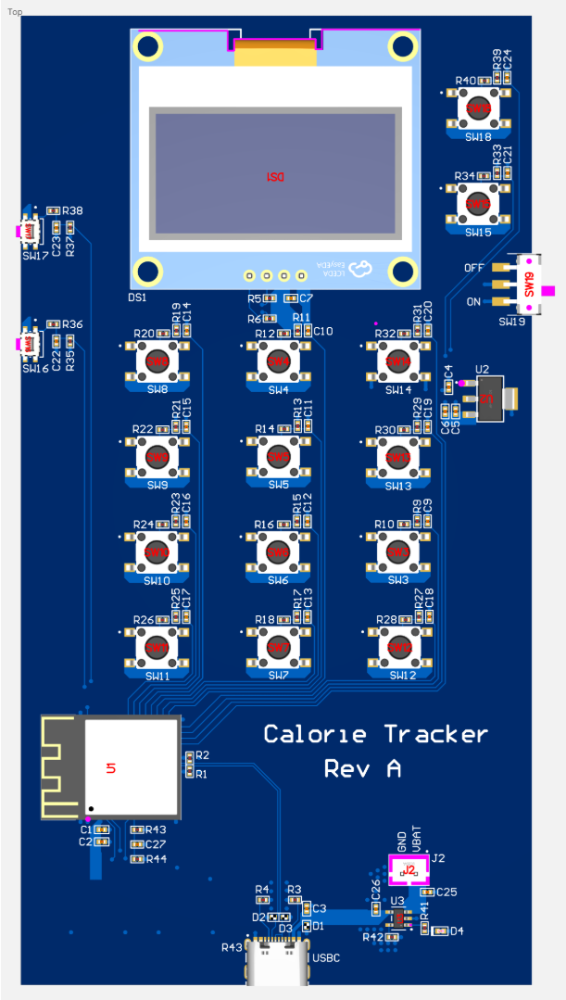

# Calorie Tracker PCB



A compact embedded handheld device built around an **ESP32-S3**, featuring an **OLED display**, **button-based numeric input**, **USB-C power/programming**, **battery charging**, and onboard **3.3V regulation** to track cumulative calorie intake.

This project focuses on the **hardware design** of a portable calorie tracker, including schematic capture, PCB layout, power architecture, button input circuitry, and manufacturing files. Firmware bring-up is being developed separately using an ESP32-based prototype platform before full hardware fabrication.

---

## Overview

The goal of this project was to design a custom handheld PCB that could serve as a dedicated calorie tracking device. The board is centered around an **ESP32-S3** and uses a **OLED display** for UI output, along with a set of **physical buttons** for entering values and navigating the interface.

The design includes:

- **ESP32-S3** microcontroller
- **OLED display** interface
- **button-based input** with debounce filtering
- **USB-C** for power and programming
- **battery charging / battery connector**
- **VBAT to 3.3V regulation**
- **persistent storage support through the MCU**
- custom schematic, PCB layout, BOM, pick-and-place, and fabrication files

---

## Key Features

- Custom **ESP32-S3 handheld PCB**
- **OLED display** for calorie total and UI feedback
- **Button-based numeric input** and menu navigation
- **USB-C power and programming**
- **Battery charging and power-path support**
- Onboard **3.3V regulator**
- Hardware debounce on user input buttons
- Organized design files for manufacturing and documentation

---

## Hardware Highlights

### Main Components
- **ESP32-S3** microcontroller
- **1.54" OLED display** interface
- **USB-C connector** with protection and CC resistors
- **Battery charging IC**
- **VBAT to 3.3V regulator**
- Tactile buttons for:
  - numeric entry
  - menu/navigation
  - reset
  - boot/programming access

### Design Considerations
- Routed dedicated **power rails** for **VBAT**, **VSYS**, and **+3V3_REG**
- Added local **decoupling capacitors** near critical ICs
- Implemented **button debounce/filter networks**
- Used **ground stitching vias** in USB and power areas
- Kept USB protection and power components grouped tightly near the connector

---

## Current Status

### Completed
- Schematic capture
- PCB placement and routing
- Power architecture
- USB-C and protection layout
- OLED and button interface design
- BOM / CPL / manufacturing file generation
- LTspice simulation for button debounce validation

### In Progress
- Firmware prototyping on ESP32 development hardware
- UI / input logic validation
- Pre-fabrication review and cleanup

### Planned
- Fabrication / assembly
- Bring-up and validation on final custom board
- Enclosure integration
- Final user interface refinement

---

## Repository Structure

```text
Calorie_Tracker_PCB/
├── docs/
├── firmware/
├── hardware/
│   ├── 3d_model/
│   ├── bom/
│   ├── drc/
│   ├── gerber/
│   ├── nc_drill/
│   ├── pcb/
│   ├── pick_place/
│   └── schematic/
├── images/
├── simulations/
│   └── ltspice/
├── LICENSE
└── README.md
